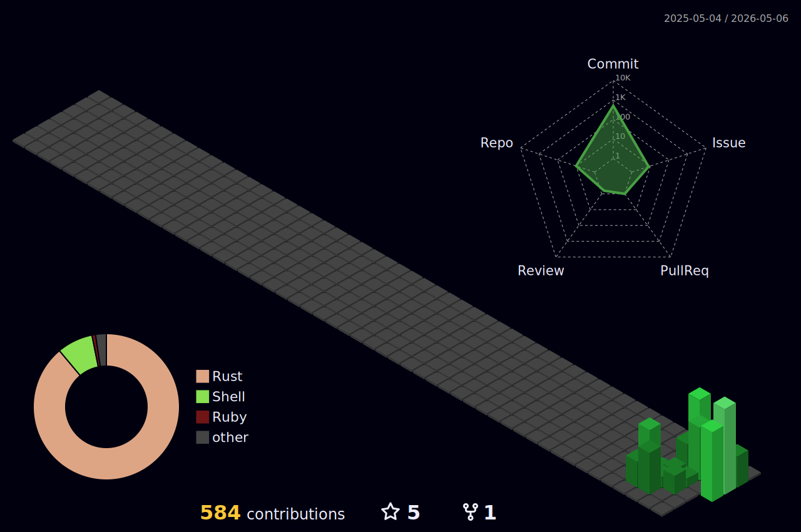

**`Backend · On-Device ML · Systems`**

---

<picture>
  <source media="(prefers-color-scheme: dark)" srcset="./profile-3d-contrib/profile-night-green.svg">
  <source media="(prefers-color-scheme: light)" srcset="./profile-3d-contrib/profile-green.svg">
  
</picture>

---

**Core stack**
 

---

### About

Systems engineer focused on **on-device speech AI** in Rust.  
Building local-first STT and speaker diarization pipelines with zero cloud dependencies.

Previously worked across backend, distributed systems and ML inference optimization.  
Open to collaborations on Rust audio/ML tooling and high-performance systems.

---

**Featured projects**

<a href="https://github.com/ekhodzitsky/gigastt"><strong>gigastt</strong></a> — Local STT server powered by GigaAM v3

<a href="https://github.com/ekhodzitsky/polyvoice"><strong>polyvoice</strong></a> — Who spoke when, without Python. Silero VAD + WeSpeaker + AHC in one Pipeline::run()

Bonus — Rust tooling: <a href="https://github.com/ekhodzitsky/cargo-kimi"><strong>cargo-kimi</strong></a>, cargo subcommand for structured contracts &amp; Hoare-triple verification.

---

